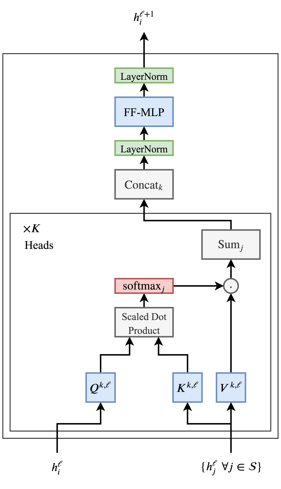

## 从零开始编写Transformers（pytorch）

关键词：NLP，sentiment analyis，transformers，self-attention，神经网络

> What I cannot create, I do not understand。 —— Richard Feynman

很喜欢费曼老师的这句话。学deep learning的时候，经常会因为过于重视理论部分而忽视了代码implmentation。很多时候感觉原理看明白了，但是代码却一行写不出来。所以今天就从零开始写一个transformers吧！当然，back propagation一类底层的工作还是交给Pytorch来处理，我们关注的是上层的transformers结构。本篇博客大体参考[这篇博文](http://peterbloem.nl/blog/transformers)。

***注：本篇博客假设读者已经有基本的ML和NN相关知识，例如反向传播，NLP，以及可以使用Pytorch做简单的操作。**

### 什么是Transformers？

Transformers是一种神经网络中的结构，它是一种sequence到sequence的模型，也就是说，我们输入一个序列，就可以输出相同长度的新的序列。这里的sequence可以是一段文字，也可以是一串像素点，一串向量。尤其是在自然语言处理（NLP）领域，因为文字往往拥有序列性，很适合应用transformers，并且在语义识别，文本生成，文本翻译等领域，其展现出了目前为止最好的效果。比较出名的模型，例如BERT，以及这两天很火的GPT-3，都用到了它。总之，这玩意儿很强，用过的人都说好。


在Transformers出现之前，最流行的模型是RNN（例如LSTM或者GRF）。但是RNN模型存在一个效率问题，在RNN中，为了计算第n个cell的输出，我们必须首先计算第n-1个cell，因为这是第n个cell的输入。这使得RNN的计算效率很低，无法像CNN那样parallel计算。并且如果这个sequence特别长，较远cell之间的关系会减弱，难以表现在输出的sequence中。虽然上述的LSTM等模型尝试解决这个问题，但是效果仍不理想。


Transfomers完美克服了这两个问题。How？

首先我们要了解transformers的原理。而说到transformers，首先要了解的就是self-attention。

#### self-attention

关于Attention本身就可以再写一篇博客了，这里只做简单的介绍。详细的内容可以[看这里](https://lilianweng.github.io/lil-log/2018/06/24/attention-attention.html#:~:text=Self%2Dattention%2C%20also%20known%20as,representation%20of%20the%20same%20sequence.&text=The%20long%20short%2Dterm%20memory,attention%20to%20do%20machine%20reading.)（以后或许会翻译）。这里介绍的self-attention内容主要基于[Attention is all you need](https://arxiv.org/abs/1706.03762)。这篇论文首次提出，简单的attention结构就足以表达很复杂的文字关系。

attention可以理解为单词于单词之间的关联程度。比如下图[1]：


直观地来看，相较于“吃”和“苹果”的关联，“吃”和“绿色的”关联应该弱一些。相对的，“绿色的”和“苹果”之间的关联应该强于“吃”和“绿色的”关联。那么我们该如何表示这个“关联”呢？首先，我们用一个vector来表示一个单词，每个单词有自己对应的vector。这一步叫embedding。这个对应的vector是需要通过反向传播来学习的。然后，我们用两个单词的vector的点乘来表示这两个单词之间关系的权重。举个例子：
$$
假设 \ eating是x_i=\left(
\begin{matrix}
1\\
2\\
3\end{matrix}\right)
, \ \
green是x_j=\left(
\begin{matrix}
4\\
5\\
6\end{matrix}\right)
\\
W_{ij} = x_i^T * x_j = 32
$$
这是i关于j的权重。值得注意的是j关于i的权重是一样的。下一步，我们算出i关于所有j的权重，然后进行一次softmax操作。这样使得：
$$
\sum_jW_{ij} = 1
$$
也就是说我们得到了每个单词j相对于i的关联性的权重。我们希望得到
$$
W_{eating,apple} > W_{eating,green}
$$
也就是说，**在这个句子中 **，对于eating这个单词，apple与其关联性大于green。这是经过神经网络学习embedding，我们希望最终得到的结果。我们之前说过，transformer输出一个sequence。所以接下来我们求所有单词关于i的加权平均数，这就是输出序列的第j位：
$$
y_j = \sum_jW_{ij} * x_j
$$
对每一个j都进行上述操作，我们就得到了输出序列 **y**.它的长度和输入序列是一样的。我个人把它理解为，每个y是对应单词与其他单词关联性的加权平均数。下图[2]展示了上述过程（softmax未展示）：


以上就是self-attention最基础的内容。我们在此基础上增加一些内容来提升模型的实用性。首先，单纯使用embedding vector，模型的变化不大，所以我们给上述过程中每一个vector添加一个可以学习的weight，分别叫做key，query，value。那么我们的计算过程会变成这样：
$$
k=w_{key}*x_j \ , q=w_{query}*x_i^T \ , v=w_{value}*x_j \\
W_{ij} = q * k
\\W_{ij} = softmax(W_{ij})\\
y_j = W_{ij}*v
$$
参数的增加使得我们的输入更加可控。如下图[2]：


图中蓝色是key，红色是query，绿色是value。

接下来，为了防止权重W过大，我们在softmax前做一个scale down：
$$
W_{ij} = softmax(\frac{W_{ij}}{\sqrt{k}}), 这里 \ k \ 是 \ embedding \ vector \ 的维度（上边的例子里k=3）
$$
这样得到的一串y就是self-attention最终输出。

值得注意的是，attention里所有单词都是可以平行计算的，这就大大提高了计算效率。但是这也带来一个问题：如果我们把这句话里所有单词随机打乱顺序，对应单词的计算结果是不变的。换句话说，单个的self-attention忽略了单词之间语序，“我爱你”和“你爱我”两句话中的“爱”，尽管主语和宾语不同，却会得到相同的y。为了解决这个问题，我们使用多个self-attention并列（multi-head self-attention），每个self-attention有自己单独的key，query，value weights。我们把这些并列的attentions 称为‘heads’。这样不同的attention会收敛于不同的分布，表达不同的features。再经过一个linear mapping来求和这些features，就可以表达更多的信息。

好了，说了这么多，我们来写代码，实现multi-head self-attention block。代码中有详细的注释：

```python
import torch
import torch.nn as nn
import torch.nn.functional as F
import torch.optim as optim
from torch.utils.data import DataLoader
from torch.utils.data import sampler

import torchvision.datasets as dset
import torchvision.transforms as T

from torchtext import data, datasets, vocab
# from torchtext.experimental.datasets import IMDB
import tqdm

import numpy as np
```

```python
# multi-head self-attention
class SelfAttention(nn.Module):
    # 这里我们用h个heads，每个都有自己的q，k，v；然后embedding vector维度是k
    def __init__(self, k, h = 8):
        super().__init__()
        self.k, self.h = k, h
        
        # weights of q, k, v, tranform from (b, t, k) to (b, t, k*h)
        # 把所有keys，queries，values绑成一个matrix方便计算
        self.get_query = nn.Linear(k, k*h, bias=False)
        self.get_key   = nn.Linear(k, k*h, bias=False)
        self.get_value = nn.Linear(k, k*h, bias=False)
        # combine multiheads into one，合并multiheads
        self.unified   = nn.Linear(k*h, k, bias=False)
        
    def forward(self, x):
      	# input shape (b, t, k), b=batch size, t=sequence length, k=embedding dimension
        b, t, k = x.size()

        # shape (b, t, k) -> (b, t, k, h)
        query = self.get_query(x).view(b, t, k, self.h)
        key   = self.get_key(x).  view(b, t, k, self.h)
        value = self.get_value(x).view(b, t, k, self.h)
        
        # in order to apply bmm, we need shape (b * h, t, k) and (b * h, k, t)
        # bmm只能保留第0维度，所以我们给key，query，value变形，使得batch size和h都可以保留
#         print(query)
#         print(query.transpose(1, 2))
#         print(torch.reshape(query, (b, k, t, self.h)))
        query = torch.reshape(query.transpose(1, 2), (b * self.h, t, k))
        key   = torch.reshape(key.transpose(1, 2),   (b * self.h, k, t))
        value = torch.reshape(value.transpose(1, 2), (b * self.h, t, k))
#         print(query.shape)
#         print(key.shape)
        
        # scale down
        query = query / (k ** (1/4))
        key   = key   / (k ** (1/4))
        
        # calc attention
        # out shape (b * h, t, t)
        raw_weights = torch.bmm(query, key)
        weights = F.softmax(raw_weights, dim=2)
        # (b*h, t, t) * (b*h, t, k) = (b*h, t, k), reshape back to (b, t, k*h)
        attentionA = torch.reshape(torch.bmm(weights, value).transpose(1, 2), (b, t, self.h*k))
        #下边这句效果相同
#         attentionB = torch.bmm(weights, value).transpose(1, 2).contiguous().view(b, t, self.h * k)
        # combine multiheads, shape (b, t, k*h) to (b, t, k)
        out = self.unified(attentionA)
        return out
        
# test
x = torch.rand((1, 3, 2))
test = SelfAttention(2, 4)
test(x)
```

##### Transformer

终于可以开始讲transformer本体了！下图[3]给出了一个transformer block的基本结构：



你会发现，其实transformer大部分内容我们已经讲过了，也就是上文写的multihead self-attention block。图中写了x K heads的部分就是k个heads的self attention block。虽然和我们的标注略有不同，但是结构是完全一样的。输入的h（上文的x）在经过了attention block后，经过concat（也就是multiheads最后的linear mapping）， 再经过一次layer normalization，一个全连接层，再一次layer normalization，得到的输出就是transformer block的最终输出。直接上代码：

```python
# transformer block
class MyTransformerBlock(nn.Module):
    def __init__(self, k, h):#h = number of heads, k = embedding dimension
        super().__init__()
        self.k, self.h = k, h
        self.attention = SelfAttention(k, h) # 上文的 multiheads self-attention block
        self.layerNorm1 = nn.LayerNorm(k)
        self.layerNorm2 = nn.LayerNorm(k)
        self.fc         = nn.Sequential( #全连接层。这里可以调节层数，维度。
                            nn.Linear(k, 2*k),
                            nn.ReLU(),
                            nn.Linear(2*k, k),
        )
        
    def forward(self, x):
        atten = self.attention(x)
        norm1 = self.layerNorm1(atten + x)
        ### try ### # 实验不同的layer-norm方式
#         norm1 = self.layerNorm1(atten) + x
        mapping = self.fc(norm1)
        norm2 = self.layerNorm2(mapping + norm1)
        
        return norm2

#test
trans = MyTransformerBlock(2, 4)
trans(x)
```

### Transformers结构的进化

如果你拜读过那篇经典的论文[Attention is all you need](https://arxiv.org/abs/1706.03762)，你会发现这里讲的transformers和原作者提出的略有不同。原作者提出的结构是encoder-decoder结构。由类似上文所讲的结构分别组成encoder和decoder，encoder将输入映射到一个latent space中，得到一个表示输入的vector。然后decoder用这个vector计算出输出。然而近两年的研究表明，仅依靠上述transformer blocks的叠加，就足以获得强大的文本表达力，例如BERT和GPT-2都不再使用encoder-decoder结构。接下来我们写一个trnasformer block的使用实例。

### 怎么用Transformers？

这里举一个sentiment analysis的例子。sentiment analysis即语言情感分析，例如判断一个电影的评；论是积极的还是消极的。积极和消极是两个class，这本质上是一个classification的任务。所以我们设计如下神经网络[2]：


以下几点值得注意：

首先，除了word embedding，也就是上文提到的用vector代替单词的过程，这里还有一个position embedding。它的作用是将单词的位置作为输入添加到word embedding vector上。这使得单词之间的位置关系可以更好的反映在网络中。既然是embedding，那么position就并不是简单的直接和word embedding vectors相加，而是要首先映射到某个vector上，然后vector相加。

其次，相加后的输入并不单单通过一层tranformer，而会通过多层transformers。这样模型的表达力大幅增加了。因为tranformers block并不改变输入的形状（shape不变），所以上一层的输出可以直接作为下一层的输入。

transformers得出的结果会经过average pooling，然后经过一个全连接层映射到两个class上（positive or negative）。关于什么是average pooling和classification这里不再赘述。

上代码：

```python
# classifier using transformer
class MyTransformer(nn.Module):
  	'''
  	parameters:
  	k : embedding dimension
  	h : number of heads
  	l : length of input sequence
  	num_trans_layers : number of transformer blocks
  	num_token : total number of tokens (总词汇量)
  	num_class : 2 in this case 
  	'''
    def __init__(self, k, h, l, num_trans_layer, num_token, num_class=2):
        super().__init__()
        self.k, self.h, self.num_token, self.num_class = k, h, num_token, num_class
        # create embedding
        self.tokenEmbedding = nn.Embedding(num_token, k)
        self.positEmbedding = nn.Embedding(l, k)
        
        # transformers
        transformer_list = []
        for i in range(num_trans_layer):
            transformer_list.append(MyTransformerBlock(k, h))
        self.transformers = nn.Sequential(*transformer_list)
        
        # last linear mapping layer, mapping from (b, k) to (b, 2)
        self.fc = nn.Linear(k, num_class)
        
    def forward(self, x):
        # x is batched integers representing words, shape (b, t), b is batch size
        # embedding result shape (b, t, k)
        tokens = self.tokenEmbedding(x)
        b, t, k = tokens.size()
        # position embedding, shape (t, k)
        positions = self.positEmbedding(torch.arange(t))
#         print(positions.shape)
        # set to right shape, resulting shape (None, t, k)
        positions = positions[None, :, :]
#         print(positions.shape)
				# resulting shape (b, t, k)
        positions = positions.expand(b, t, k)
#         print(positions.shape)
        input_ = positions + tokens
        
        # average pooling over embedding dimension, resulting shape (b, k)
        avg = self.transformers(input_).mean(dim=1)
        
        output = F.log_softmax(self.fc(avg), dim=1)
        # output shape (b, 2)
        return output
        
               
# test      
x = torch.randint(100, (3, 4))
# x = torch.zeros_like(x)
testTrans = MyTransformer(5, 2, 4, 2, 100, 2)
testTrans(x)    
```

接下来就是训练模型了。我们用到的数据是[IMDB](https://www.imdb.com/interfaces/)，这是一个电影评价的文本数据集，在语义分析领域很常用，并且在Pytorch的文本处理包torchtext内自带。

首先我们需要做数据的导入和处理，用torchtext一切都很简单：

```python
# data argumentation
## 注：以下部分是torchtext官方doc中推荐的引入数据集的方法，有两种。这里我们用第一种。torchtext最近在更新，几个版本后这个方法可能就不能用了。到时候看官方怎么搞吧。
'''
# Approach 1:
# set up fields
TEXT = data.Field(lower=True, include_lengths=True, batch_first=True)
LABEL = data.Field(sequential=False)


# make splits for data
train, test = datasets.IMDB.splits(TEXT, LABEL)

# print information about the data
print('train.fields', train.fields)
print('len(train)', len(train))
print('vars(train[0])', vars(train[0]))

# build the vocabulary
TEXT.build_vocab(train, vectors=GloVe(name='6B', dim=300))
LABEL.build_vocab(train)

# print vocab information
print('len(TEXT.vocab)', len(TEXT.vocab))
print('TEXT.vocab.vectors.size()', TEXT.vocab.vectors.size())

# make iterator for splits
train_iter, test_iter = data.BucketIterator.splits(
    (train, test), batch_size=3, device="cuda:0")

# print batch information
batch = next(iter(train_iter))
print(batch.text)
print(batch.label)

# Approach 2:
train_iter, test_iter = datasets.IMDB.iters(batch_size=4)

# print batch information
batch = next(iter(train_iter))
print(batch.text)
print(batch.label)
'''

TEXT = data.Field(lower=True, include_lengths=True, batch_first=True)
LABEL = data.Field(sequential=False)

train, test = datasets.IMDB.splits(TEXT, LABEL)

TEXT.build_vocab(train, max_size=vocab_size - 2)
LABEL.build_vocab(train)

# 这里的iterator返回的是一个特殊object，这个object包含以下attributes：
# .text: 一个tuple：（batch的文本原文的integer representation，每条文本长度）
# .label: list of correct labels.注意这里的label是1，2不是0，1.
# 是的，所有的单词都会转化成一一对应的integer，可以理解成单词的编号。当然这个和我们模型中的embedding
# 是不同的，embedding 返回的是vector，并且可以学习。
train_iter, test_iter = data.BucketIterator.splits((train, test), batch_size=batch_size, device=device)

print(f' {len(train_iter)} training examples')
print(f' {len(test_iter)} {"test"} examples')

max_length = max([input.text[0].size(1) for input in train_iter])
max_length = max_length * 2
print(f'maximum sequence length: {max_length}')
```

一些超参数，这几行代码最好放到数据导入的前边：

```python
num_epoches = 10
batch_size  = 4
lr          = 0.0001
embedding_size = 128 # k
vocab_size  = 50000  # num_token
h = 8                # number of attention heads
d = 6                # number of transformer layer
# gradient clipping：大于一个定值的gradient全部减小到boundary
gradient_clipping = True #1.0
# learning rate warm up：lr会逐渐增大，防止在模型开始训练初期出现过大的梯度变化导致模型在local minima收敛
lr_warmup = True #10000

device = 'cuda:0' if torch.cuda.is_available() else 'cpu'
```

我们的模型闪亮登场；

```python
# build the model
model = MyTransformer(embedding_size, h, max_length, d, vocab_size, 2)
model.to(device)
# optimizer
opt = torch.optim.Adam(lr=lr, params=model.parameters())
# lr scheduler
if lr_warmup:
    sch = torch.optim.lr_scheduler.LambdaLR(opt, lambda i: min(i / (10000 / batch_size), 1.0))
```

最后，训练模型。pytorch训练模型的代码大同小异，这里不再展开介绍：

```python
# train
for e in range(num_epoches):

    print(f'\n epoch {e}/{num_epoches}')
    model.train(True)
		
    # tqdm 可以展示当前训练进度
    for batch in tqdm.tqdm(train_iter):

        opt.zero_grad()
				
        # 输入文本（已转化成integer）,关于input的格式在上文数据导入代码中有介绍
        input = batch.text[0]
        # label从1，2变0，1
        label = batch.label - 1
				# 超过设定长度的文本被剪切
        if input.size(1) > max_length:
            input = input[:, :max_length]
        out = model(input)
        loss = F.nll_loss(out, label)

        loss.backward()

        # clip gradients，上文有介绍
        if gradient_clipping:
            nn.utils.clip_grad_norm_(model.parameters(), 1.0)

        opt.step()
        # lr_warmup，上文有介绍
        if lr_warmup:
            sch.step()

    with torch.no_grad(): # evaluation

        model.train(False)
        tot, cor= 0.0, 0.0

        for batch in test_iter:

            input = batch.text[0]
            label = batch.label - 1

            if input.size(1) > max_length:
                input = input[:, :max_length]
            # 输出的两个class较大的一个为最终classification结果
            out = model(input).argmax(dim=1)

            tot += float(input.size(0))
            cor += float((label == out).sum().item())
				#计算accuracy：正确数量/总数量
        acc = cor / tot 
        print(f'-- {"test" if arg.final else "validation"} accuracy {acc:.3}')
```


因为家里没有带CUDA的电脑，这个模型没有调参，最终结果可能会惨不忍睹。感兴趣的话你可以自己做fine-tuning。可以调节的部分：

- transformer block中，全连接层的结构
- 超参数。包括epochs个数，batch size，learning rate，embedding dimension，heads个数，transformer层数。
- 你也可以尝试不同的结构，或者去看看当前SOTA（state of the art）的模型是怎么设计的。


### 总结

以上，就是一个简单的transformer，并用它来做语义识别的project。Transformer是时下热门，进化速度也很快，还有很多值得学习的内容。如果我的内容中有任何错误欢迎指出！联系方式在我的博客展示页。


------


[1]: https://lilianweng.github.io/lil-log/2018/06/24/attention-attention.html#:~:text=Self%2Dattention%2C%20also%20known%20as,representation%20of%20the%20same%20sequence.&amp;text=The%20long%20short%2Dterm%20memory,attention%20to%20do%20machine%20reading.	"图片来源"
[2]: http://peterbloem.nl/blog/transformers	"图片来源"
[3]: https://thegradient.pub/transformers-are-graph-neural-networks/	"图片来源"

